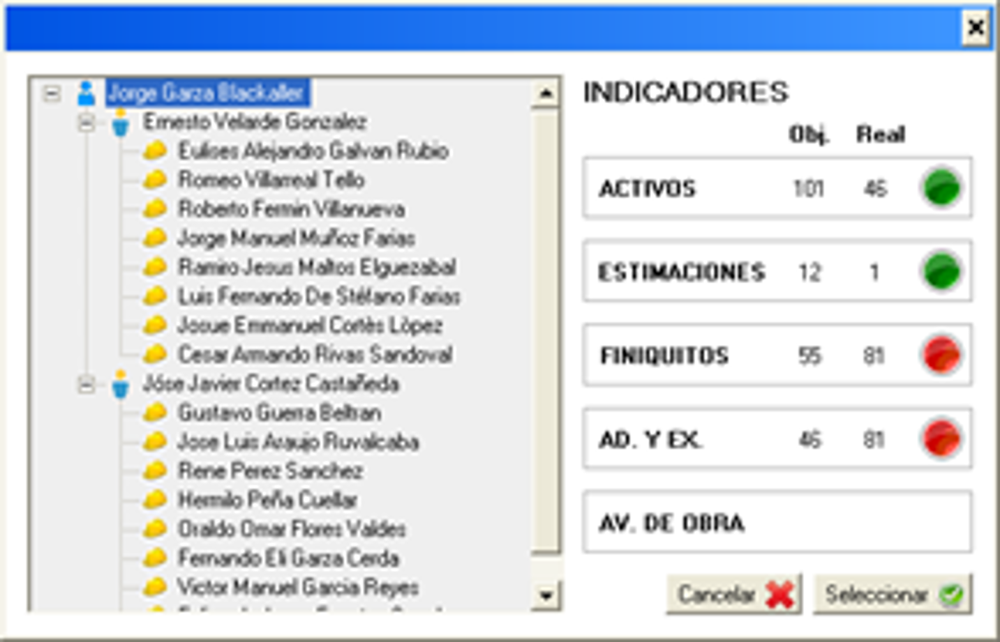

# 📊 SICAP Indicadores

## 🧭 Overview
**SICAP Indicadores** (also referred to as **[SICAP](https://github.com/HermiloOrtega/SICAP)** Traffic Lights) is a persistent Windows application developed in **C#** and **SQL Server**. Its purpose is to provide real-time visibility into critical contract KPIs for engineers, managers, and directors. Positioned at the top-right of a user’s screen, the app is always visible and auto-starts on login—ensuring awareness and accountability.

Built for the direction of projects at AHMSA, the system is a companion to **[SICAP](https://github.com/HermiloOrtega/SICAP)** and **[SICAP Web](https://github.com/HermiloOrtega/SICAP-Web)**, pulling data from shared databases to display high-level visual indicators about project performance.

> 

> 

## 💡 Idea & Concept
This system was developed to solve a major visibility problem—users were unaware of their KPI status unless they opened **[SICAP](https://github.com/HermiloOrtega/SICAP)** manually. **SICAP Indicadores** keeps those insights front and center at all times.

- View KPIs like: Active Projects, Pending Estimations, Contracts near close, Contract Overruns, and Progress
- Simplify reporting by offering always-available, real-time dashboards
- Display traffic-light indicators based on thresholds defined by leadership

## ✨ Features & Functionality
- 📌 Always-on Windows App with auto-start
- 📊 Grid of indicators with columns:
  - KPI Type
  - Target Threshold
  - Actual Value
  - Traffic Light (Green, Yellow, Red)
- 🧭 Manager View: Org chart navigation to view team member KPIs
- 📅 Last Update Display: Timestamp of latest sync from **[SICAP Updater](https://github.com/HermiloOrtega/SICAP-Web-Updates)**
- 📥 Drill-Downs: Click any indicator to view associated data in pop-up
- 🔒 Multi-instance prevention + screen size restriction
- 🧪 Auto-close and restart when updates are pushed

## ⚙️ Tech Stack
| Category                | Tools & Frameworks |
|-------------------------|--------------------|
| **Frontend**            |  |
| **Backend**             |  |
| **Platform**            |  |
| **Framework**           |  |
| **IDE**                 |  |
| **Database**            |  |
| **Other**               |  |

## 🏗 Architecture & Design
- Built as a floating persistent UI panel
- Syncs daily via **[SICAP Updater](https://github.com/HermiloOrtega/SICAP-Web-Updates)** (batch + incremental data)
- Role-based filtering and data masking
- Access permissions defined per department/user profile
- Displays live visual traffic lights for each KPI metric
- Pop-up drilldowns rendered using data-bound forms

## 🚀 Installation & Setup
- **Deployment:** Installed per user on company machines
- **Startup:** Auto-start via registry/task scheduler
- **Prevention:** Restricts screen resizing, duplication, and shutdown
- **Update Alerts:** Admin can broadcast updates, lock modules, or block access

> **Note:** Only internal users approved in the database can use the app.

## 🧑‍💻 Usage
1. Launches automatically on system boot
2. View personal KPI grid + color indicators
3. Click traffic light to drill down into details
4. Managers can view subordinates via the org chart panel

## 🔍 My Role & Contributions
- 💼 Full Design, UX, and Backend Integration
- 🔧 Created auto-start logic, multi-instance lock, and update handler
- 🧠 Designed KPI definitions and indicator logic with leadership
- 🧾 Built grid interactions, drilldowns, and admin control module
- 🤝 Coordinated with SICAP team to reuse data logic and design

## 🧗 Challenges & Learnings
- Built always-on UI that doesn’t interfere with desktop usage
- Designed cross-functional drilldowns that support all user levels
- Delivered a performance-optimized app with <1s load time
- Integrated real-time notifications for update enforcement

## 📈 Future Enhancements
- Mobile version for field engineers
- API-based update stream instead of file-sync from SICAP Updater
- Option to customize KPIs per user

## 🪪 License
⚠️ **Internal Use Only**  
Originally under MIT; changed to **CC BY-NC-ND 4.0** as of April 22, 2025.

## 🔗 Related Projects
- **[SICAP Web](https://github.com/HermiloOrtega/SICAP-Web)**
- **[SICAP](https://github.com/HermiloOrtega/SICAP)**
- **[SICAP Updater](https://github.com/HermiloOrtega/SICAP-Web-Updates)**
- **[SICAP Foliador](https://github.com/HermiloOrtega/SICAP-Folio-Manager)**
